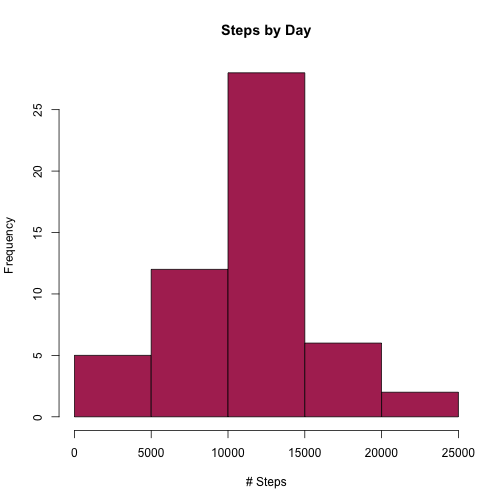
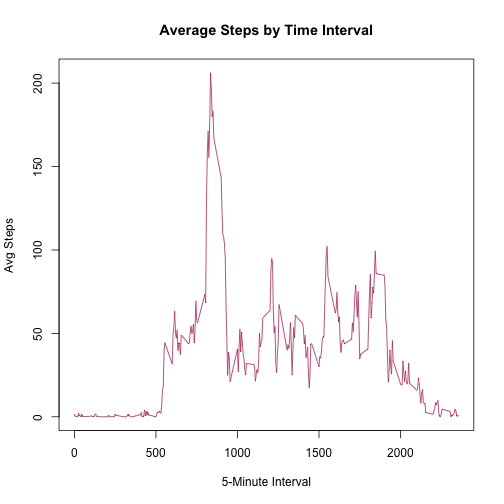
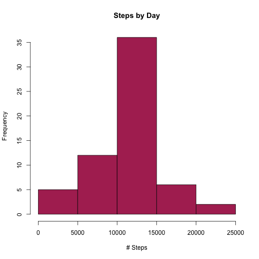
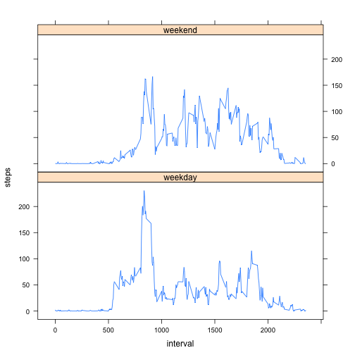

## Step 1: Read in Data

Reads in raw activity file from working directory and converts date/time to POSIX, after parsing interval into H:M.


```r
step_data <- read.csv("activity.csv")
hours <- floor(step_data$interval/100)
minutes <- step_data$interval - (hours * 100)
time <- paste(as.character(hours),":",as.character(minutes), sep="")
step_data$datetime <- with(step_data, as.POSIXct(paste(step_data$date, time), format="%Y-%m-%d %H:%M"))
summary(step_data)
```

```
##      steps                date          interval     
##  Min.   :  0.00   2012-10-01:  288   Min.   :   0.0  
##  1st Qu.:  0.00   2012-10-02:  288   1st Qu.: 588.8  
##  Median :  0.00   2012-10-03:  288   Median :1177.5  
##  Mean   : 37.38   2012-10-04:  288   Mean   :1177.5  
##  3rd Qu.: 12.00   2012-10-05:  288   3rd Qu.:1766.2  
##  Max.   :806.00   2012-10-06:  288   Max.   :2355.0  
##  NA's   :2304     (Other)   :15840                   
##     datetime                  
##  Min.   :2012-10-01 00:00:00  
##  1st Qu.:2012-10-16 05:58:45  
##  Median :2012-10-31 11:57:30  
##  Mean   :2012-10-31 12:24:00  
##  3rd Qu.:2012-11-15 17:56:15  
##  Max.   :2012-11-30 23:55:00  
## 
```

## Step 2 - Summary and Plot

First, sum steps by day and plot the histogram.


```r
by_day <- tapply(step_data$steps, step_data$date, FUN=sum)
hist(by_day, col="maroon", xlab = "# Steps", ylab = "Frequency", main = "Steps by Day")
```



Then calculate the mean and median of steps by day.


```r
mean(by_day, na.rm=TRUE)
```

```
## [1] 10766.19
```

```r
median(by_day, na.rm=TRUE)
```

```
## [1] 10765
```

## Step 3 - Average Daily Activity

Calculate the mean across all days for each interval using aggregate() and generate a line plot of the results.


```r
int_avg <- rename(aggregate(step_data$steps ~ step_data$interval, FUN=mean, na.rm=TRUE),
                  c("step_data$steps" = "steps", "step_data$interval" = "interval"))
plot(int_avg$interval, int_avg$steps, type="l", col="maroon",
     xlab = "5-Minute Interval", ylab = "Avg Steps", main = "Average Steps by Time Interval")
```



Find the daily interval with the maximum average steps.


```r
int_avg[which.max(int_avg$steps),]
```

```
##     interval    steps
## 104      835 206.1698
```

## Step 4 - Impute Missing Values

Replace missing values with the mean for non-missing intervals, then plot the histogram.
Missing values for steps are replaced with the (non-missing) average for the interval across the entire period.
This is accomplished by looping through the observations and using the averages calculated in Step 3 above.


```r
step_data_noNA <- step_data
for(i in 1:nrow(step_data_noNA)){
    step_data_noNA[i,1][is.na(step_data_noNA[i,1])] <- int_avg$steps[int_avg$interval==step_data_noNA[i,3]]
}
by_day_noNA <- tapply(step_data_noNA$steps, step_data_noNA$date, FUN=sum)
hist(by_day_noNA, col="maroon", xlab = "# Steps", ylab = "Frequency", main = "Steps by Day")
```



Then calculate the mean and median of steps by day.


```r
mean(by_day_noNA, na.rm=TRUE)
```

```
## [1] 10766.19
```

```r
median(by_day_noNA, na.rm=TRUE)
```

```
## [1] 10766.19
```

## Step 4 - Weekdays vs. Weekends
### Looking for steps patterns between the two

First, split the step data into weekdays and weekends using the weekdays() function.
Then calculate average steps by interval and day type using aggregate(), plot as stacked histograms.


```r
weekends <- c("Saturday","Sunday")
weekend_factor <- factor((weekdays(step_data_noNA$datetime) %in% weekends),
                         levels=c(FALSE,TRUE), labels=c("weekday","weekend"))
int_avg <- rename(aggregate(step_data_noNA$steps, by=list(step_data_noNA$interval, weekend_factor), FUN=mean),
                  c("Group.1" = "interval", "Group.2" = "weekend_factor", "x" = "steps"))
xyplot(steps ~ interval | weekend_factor, data=int_avg, type="l", layout=c(1,2))
```


